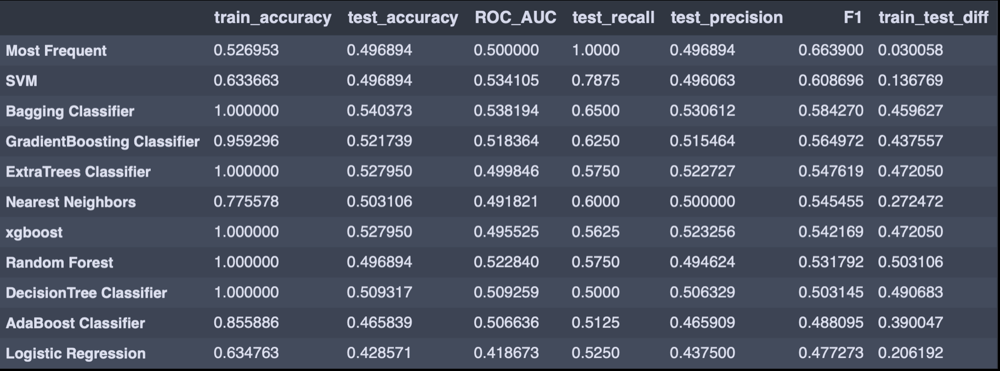
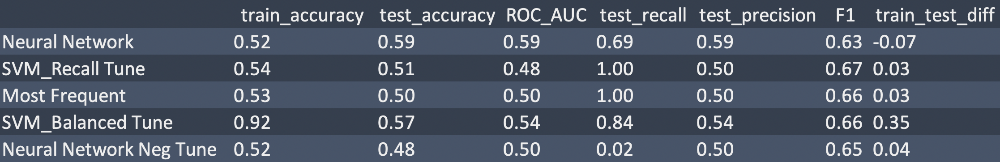
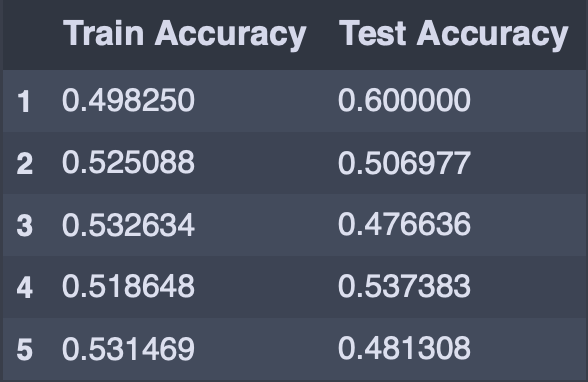

# Bitcoin Classifier

--------------------------------------

---------------------------------------

 ## Contents:

- [Problem Statement](#Problem-Statement)  
- [Background](#Background)
- [Research](#Research)
- [Data](#Data)
- [Executive Summary](#Executive-Summary)
- [Insights and Recommendations](#Conclusions-and-Recommendations)

## Problem Statement

**I’m a quantitatve researcher for a large asset manager and was asked to build a model, which generates a buy or sell decision for Bitcoin one day into the future.**

1.) Identify & extract sources of data, which could serve as soild predictors of BTC's price

2.) Generate custom data interactions using domain experience to improve predictive power

3.) Use classification modeling to identify features that aid in distinguishing between Up/Sideways and Down price action one day into the future.

## Background

Bitcoin (₿) is a cryptocurrency invented in 2008 by an unknown person or group of people using the name Satoshi Nakamoto and started in 2009 when its implementation was released as open-source software.

It is a decentralized digital currency without a central bank or single administrator that can be sent from user to user on the peer-to-peer bitcoin network without the need for intermediaries. Transactions are verified by network nodes through cryptography and recorded in a public distributed ledger called a blockchain. Bitcoins are created as a reward for a process known as mining. They can be exchanged for other currencies, products, and services.Research produced by the University of Cambridge estimates that in 2017, there were 2.9 to 5.8 million unique users using a cryptocurrency wallet, most of them using bitcoin.[(*source*)](https://en.wikipedia.org/wiki/Bitcoin).

A cultural shift towards decentralization via btc and other digital assets is well underway, spurred in part by the pandemic as well as concerns over current monetary policies been deployed which has negative side effects

## Research

"Cryptory is a robust web scraping third party module, which facilitates data sourcing from various sources, credit goes to the owner of the repo (Dashee87). In addition, I used Yahoo Finance Api to pull standard OHLC data for analysis. I aimed to pull in data to represent proxies for the following;

-  **Search/ Social Media** - Retail Demand, Overall Engagement
-  **Blockchain Network** - Crypto Adoption, Miner Supply, Overall Network Health
-  **Technicals** - Technical Trading Signals

Data is obtained from multiple online sources via Web scraping. The sources are listed below:
- Google Search Trends
- Twitter
- Reddit
- Blockchain Metrics
- Yahoo Finance

[(*Link to source*)](https://github.com/dashee87)

## Data

* [BTC_daily_since_1-2018.csv](Data/BTC_daily_since_1-2018.csv): BTC OHLC data

* [BTC_altdata.csv](Data/BTC_altdata.csv): Web scraped data from above sources

* [Jpy_daily_since_12-2017.csv](Data/Jpy_daily_since_12-2017.csv): Japanese Yen OHLC data

* [final.csv](Data/final.csv): final, clean dataframe used for EDA & Modeling purposes

* [polyfeatures.csv](Data/polyfeatures.csv): final, clean dataframe used for Modeling purposes

### Data Dictionary
The Data Dictionary is available [here](data_dictionary/data_dictionary.md).

## Executive Summary

#### Modeling Techniques
 Data was relatively balanced with the positive class accounting for ~50% of total observations during the period of data collected. Scaling was done using StandardScaler, in addition Polynomial features were derived from the original feature set and then optimized further for modeling use Principal Component Analysis. I noted a modest increase in overall accuracy across all baseline models when using PCA and polynomial features.

After transforming the data, I optimized a variety of classification models and a Neural Network (Most Frequent, Logistic Regression, Random Forest, Extra Trees, Support Vector Machine, Gradient Boosting, Nearest Neighbors, XG Boost, Decision Tree, Ada Boost) using `Pipeline` with `GridSearchCV` and `RandomizedSearchCV`, and compared model performance using Accuracy, Precision, Recall, Train_Test_diff and ROC_AUC score.

#### Baseline Model Comparison
The table below provides a comparison of metrics between all models as a baseline using (n_estimators=100, random_state=42) when possible, with F1 score as a measure of the balance  for each model.

#### Production Model Performance
The final production model a Neural Network, utilizes several layers with optimized parameters utilizing learning rate reduction and early dropout to prevent overfitting to predict one day into the future, UP/Sideways and Down events.

  See table below for production model performance.

  See table below for production NN model performance for 5 trials, as you can see this is no holy grail yet as performance varies by run therefore not ready for standalone applications.

## Insights and Recommendations

My model identifies several features for further research among those BTC_activeaddresses which had a decent correlation to price at 0.62. It would seem so that leveraging blockchain, search and social media data allows for predictions of BTC’s daily close better than a baseline model, during the time period analysied (12/31/2017 - 12/06/2020), just predicating the positive class would have been right roughly only ~49% of the time.

As with most Data Science models, this one is not good enough to use by itself, merely as a benchmark. The model predicts if price will go up/stay sideways or down but does not indicate by how much therefore transaction costs and or risk/reward ratio maybe be skewed so that it will be unprofitable. I would highly suggest anyone ready to take the model to start making money should take that into consideration, especially when applying this model in a standalone setting.

In addition, all params and final production models are not contained in this public repo to discourage those who do not heed the warning in the above statements.

------------------------------------------------------

-------------------------------
**Cryptory Disclaimer:

MIT License

Copyright (c) 2018 dashee87

Permission is hereby granted, free of charge, to any person obtaining a copy
of this software and associated documentation files (the "Software"), to deal
in the Software without restriction, including without limitation the rights
to use, copy, modify, merge, publish, distribute, sublicense, and/or sell
copies of the Software, and to permit persons to whom the Software is
furnished to do so, subject to the following conditions:

The above copyright notice and this permission notice shall be included in all
copies or substantial portions of the Software.

THE SOFTWARE IS PROVIDED "AS IS", WITHOUT WARRANTY OF ANY KIND, EXPRESS OR
IMPLIED, INCLUDING BUT NOT LIMITED TO THE WARRANTIES OF MERCHANTABILITY,
FITNESS FOR A PARTICULAR PURPOSE AND NONINFRINGEMENT. IN NO EVENT SHALL THE
AUTHORS OR COPYRIGHT HOLDERS BE LIABLE FOR ANY CLAIM, DAMAGES OR OTHER
LIABILITY, WHETHER IN AN ACTION OF CONTRACT, TORT OR OTHERWISE, ARISING FROM,
OUT OF OR IN CONNECTION WITH THE SOFTWARE OR THE USE OR OTHER DEALINGS IN THE
SOFTWARE.
